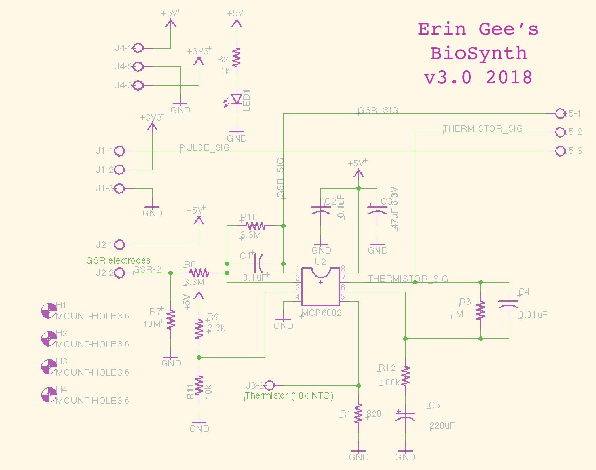

# BioData

An Arduino library for interpreting biological signals, BioData makes it easier to collect data relative to photoplethysmograph (heart sensor), including normalizing the signal, obtaining BPM, and heartbeat. This code is tested on my own respiration and GSR circuitry (image included above) as well as with a [Pulse Sensor](https://pulsesensor.com/) connected to 3.3V power source. Be aware that your results may vary with a 5V signal.

## Installation

Copy the BioData folder to your Arduino or Wiring libraries folder or download it with the Arduino library manager.

Code verified on [Arduino 2.0.3](https://www.arduino.cc/) on a [Teensy 3.2](https://www.pjrc.com/teensy/) microcontroller.

## Basic Example Using Heart

To gather heart beat data I use the [Pulse Sensor](https://pulsesensor.com/) connected to a 3.3V power source. Be aware that your results may vary when using this library with a 5V signal.

```c++
#include <Heart.h>

// Create instance for sensor on analog input pin.
Heart heart(A8);

void setup() {
  Serial.begin(9600);

  // Initialize sensor.
  heart.reset();
}

void loop() {
  // Update sensor.
  heart.update();

  // Print-out different informations.
  Serial.print(heart.beatDetected());
  Serial.print(" ");
  Serial.print(heart.getBPM());
  Serial.print(" ");
  Serial.print(heart.getNormalized());
  Serial.print(" ");
  Serial.print(heart.getRaw());
  Serial.println();
}
```

# Circuit Design

Refer to the [assembly listing](ASSEMBLY-biodatatrio3.0.pdf) for the parts.

Schematics:



# Credits

Main Developer: [Erin Gee](http://www.eringee.net)

Contributors:
* [Martin Peach](https://puredata.info/Members/martinrp/OSCobjects)
* [Thomas Ouellet Fredericks](https://github.com/thomasfredericks)
* [Sofian Audry](https://github.com/sofian)

# Copyright

This program is distributed in the hope that it will be useful, but WITHOUT ANY WARRANTY; without even the implied warranty of MERCHANTABILITY or FITNESS FOR A PARTICULAR PURPOSE. See the GNU General Public License for more details.

Released under GNU GPL 3.0 License.  Copyright Erin Gee 2018.
