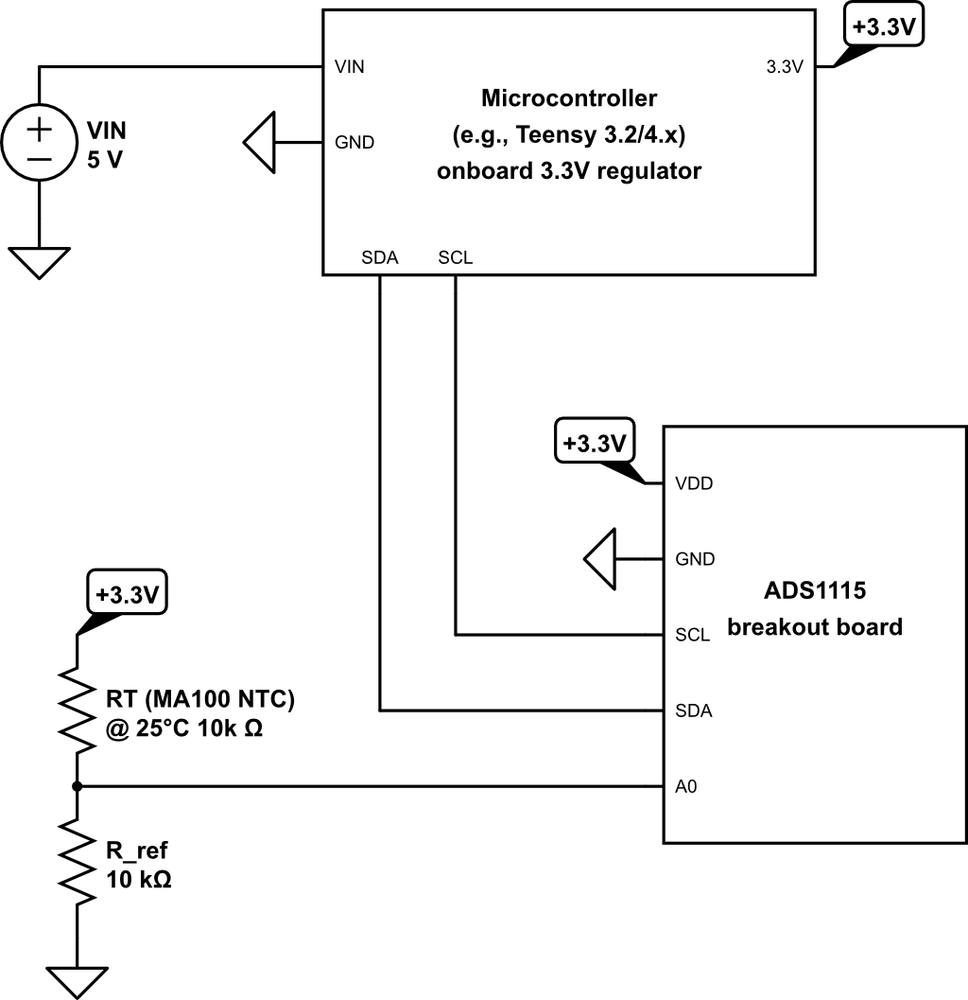

# Respiration Sensing

Thermistor-based respiration sensing circuit. 
A thermistor is a temperature-sensitive resistor.  Here, an NTC (Negative Temperature Coefficient) thermistor is used, meaning its resistance decreases as temperature increases. Placed under the nostrils, it detects the temperature changes caused by airflow during breathing. As the thermistor warms with exhalation and cools with inhalation, it produces a respiration signal.

## Components

| Component | Part |
|-----------|------|
| Microcontroller | Teensy 3.2/4.x (or any I²C-capable microcontroller) |
| External ADC | ADS1115 breakout board (any generic module) |
| NTC Thermistor | MA100 (Amphenol Thermometrics) |
| Fixed Resistor | 10kΩ |
| Power Input | USB or 5V battery |

## Circuit

The MA100 thermistor and a 10kΩ reference resistor (matching the MA100 nominal resistance at 25°C) form a voltage divider between the power rail and GND. Themidpoint voltage varies with temperature and is read by the ADS1115, an external
16-bit ADC (Analog-to-Digital Converter). Using an external ADC instead of the microcontroller's built-in ADC provides higher resolution (16-bit versus the 10-bit typical of most microcontrollers), improving sensitivity to small temperature changes. The ADS1115 communicates with the microcontroller over I²C through the SCL and SDA pins.

## Power

The system is powered from a USB or 5V battery. The ADS1115 supports 2.0–5.5V, so it is compatible with most microcontroller platforms. When using a Teensy, the onboard 3.3V regulator is used to power the ADS1115 and the thermistor circuit. This keeps the I²C lines at 3.3V, within the Teensy's SDA/SCL pin limits, and eliminates the need for an external regulator or level shifter.

## Hardware Notes

**Microcontroller** — We used a Teensy (3.2, 4.0, 4.1), but any I²C-capable microcontroller within the ADS1115 supply range (2.0–5.5V) can be substituted.

**External ADC** — ADS1115 breakout boards are widely available from multiple vendors. Ensure the module includes onboard I²C pull-up resistors (most do).

**Thermistor** — The MA100 was chosen for its temperature range close to body temperature and its small size, making it easy to mount in an oxygen tube worn under the nostrils.

## Datasheets

- [ADS1115 Datasheet](datasheets/ADS1115_datasheet.pdf)
- [MA100 Datasheet](datasheets/MA100_datasheet.pdf)